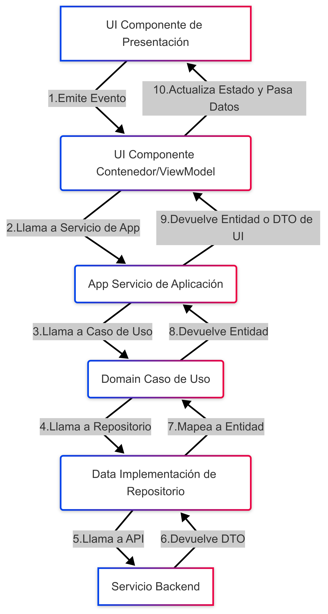

# Guía de Arquitectura Frontend en Angular

## 1\. Introducción y Propósito

> Este documento establece la arquitectura base y las convenciones para el desarrollo de aplicaciones frontend en Angular.
>
> El objetivo es proporcionar una guía **clara, pragmática y unificada** que garantice la **coherencia, mantenibilidad y escalabilidad** de nuestros proyectos.
>
> Adoptamos principios clave de **Domain-Driven Design (DDD)** y **Screaming Architecture**, organizando el código de manera intuitiva por funcionalidades (features) y capas.

### 1.1. Principios Arquitectónicos Clave

* **DDD & Clean Architecture:** El código de negocio (`domain`) es el núcleo de nuestra aplicación. Es la parte más importante y debe ser independiente de la interfaz de usuario (Angular, HTML) y de las tecnologías de API (`data`). Esto hace que nuestra lógica de negocio sea fácil de probar, reutilizar y migrar.

* **Screaming Architecture:** La estructura de carpetas de la aplicación debe "gritar" lo que hace el negocio. En lugar de organizar el código por tipo de archivo (`components`, `services`, `interfaces`), lo organizamos por funcionalidades (`features`). Una mirada rápida a la carpeta `features` debe decirte lo que hace nuestra aplicación (ej. `users`, `products`).

* **Separación de Preocupaciones:** Cada módulo, carpeta y componente tiene una única responsabilidad bien definida. Esto evita que una clase o un componente se vuelva demasiado complejo y difícil de mantener.

* **Pragmatismo:** Evitamos la complejidad innecesaria. No utilizamos un patrón solo porque "está de moda". Si un patrón de diseño (como un adaptador) no resuelve un problema real en un caso específico, no lo usamos.

* **Reusabilidad:** Centralizamos la lógica y los componentes comunes para fomentar la reutilización y evitar la duplicación de código.

-----

## 2\. Estructura General del Proyecto

Todo proyecto Angular seguirá una estructura de carpetas que refleje sus **features** y **capas** internas, utilizando la convención de nombres **`kebab-case`** para archivos y carpetas.

```bash
.
├── src/
│   ├── app/
│   │   ├── core/                   # Módulo Singleton: Lógica global y esencial
│   │   ├── common/                 # Módulo Común: Componentes y utilidades reutilizables
│   │   ├── features/               # Módulos de funcionalidad (Screaming Architecture)
│   │   │   ├── users/              # Ejemplo de Feature: Usuarios
│   │   │   │   ├── user-routing.module.ts
│   │   │   │   ├── user.module.ts
│   │   │   │   ├── app/            # Servicios de Aplicación (Orquestadores)
│   │   │   │   ├── data/           # Implementaciones (Repositorios, DTOs, Adaptadores)
│   │   │   │   ├── domain/         # Lógica de Negocio (Entidades, Casos de Uso, Interfaces)
│   │   │   │   └── ui/             # Interfaz de Usuario (Componentes visuales)
│   │   │   └── products/           # Otra Feature
│   │   │       └── ...
│   └── main.ts                     # Punto de entrada de la aplicación
├── environments/
├── assets/
└── ...
```

**Convención de Nomenclatura:**

* **Archivos y Carpetas:** Se utiliza **`kebab-case`** (`mi-componente.component.ts`).
* **Clases, Interfaces y Tipos:** Se utiliza **`PascalCase`** (`MiComponenteComponent`).
* **Variables y Métodos:** Se utiliza **`camelCase`** (`miVariable`).
* **Constantes:** Se declaran con `const` y se nombran en `SCREAMING_SNAKE_CASE` (`API_URL`).

-----

## 3\. Descripción de Módulos y Capas

### 3.1. Módulo `core`

El `core` es el cerebro de la aplicación. Es un módulo `singleton`, lo que significa que solo existe una instancia de él en toda la aplicación. Se importa una única vez en el `AppModule`.

* **Propósito:** Contener la lógica y los servicios esenciales que deben estar disponibles durante toda la vida de la aplicación.
* **Contiene:**
    * **Servicios Singleton:** Servicios que se necesitan globalmente, como `AuthService` para la autenticación o `ConfigService` para las configuraciones globales.
    * **Guards:** Lógica para proteger rutas y controlar la navegación (`AuthGuard`, `RoleGuard`).
    * **Interceptors:** Lógica para interceptar y modificar todas las solicitudes HTTP (`AuthInterceptor`, `ErrorInterceptor`).

### 3.2. Módulo `common`

El `common` es una caja de herramientas con componentes y utilidades reutilizables. A diferencia del `core`, puede ser importado por cualquier módulo de `features`.

* **Propósito:** Promover la reutilización y evitar la duplicación de código en la UI.
* **Contiene:**
    * **Componentes de UI:** Componentes genéricos como botones, modales, spinners, formularios, que no tienen lógica de negocio.
    * **Pipes y Directivas:** Pipes para formatear datos (`currency`, `dateFormatter`) o directivas para manipular el DOM (`highlight`).
* **Convenciones:** Todos los componentes en `common` son **componentes de presentación (dumb components)**.

### 3.3. Módulo `features` (Screaming Architecture)

Cada carpeta dentro de `features` representa un módulo de negocio autocontenido. La aplicación "grita" sus funcionalidades a través de estas carpetas (ej. `users`, `products`, `orders`).

#### 3.3.1. Carpeta `domain` (Lógica de Negocio Pura)

Esta es la capa más interna y más importante. Es la única que no tiene ninguna dependencia de otras capas.

* **Propósito:** Contener las reglas de negocio, las entidades y los **casos de uso** que definen la funcionalidad de nuestro negocio, sin importar la tecnología.
* **Contiene:**
    * **Entidades:** Clases o interfaces que representan los conceptos clave de nuestro negocio (ej. `User`, `Product`).
    * **Casos de Uso (Use Cases):** Clases o funciones que encapsulan una operación de negocio específica y atómica (ej. `CreateUserUseCase`). Son el punto de entrada a la lógica de negocio.
    * **Interfaces de Repositorio:** Contratos que definen cómo se accede y se persiste la información (ej. `UserRepository`). La interfaz vive aquí, pero la implementación está en la capa `data`.

#### 3.3.2. Carpeta `data` (Implementaciones Externas)

Esta capa se encarga de la comunicación con fuentes de datos externas.

* **Propósito:** Conectar el dominio con el mundo exterior. Realiza las llamadas a la API y adapta los datos al formato que necesita el dominio.
* **Contiene:**
    * **Implementaciones de Repositorio:** Clases concretas que implementan las interfaces de `domain` y se encargan de la comunicación con la API.
    * **DTOs (Data Transfer Objects):** Objetos que representan el contrato de la API. Se usan para definir los `payloads` de envío y la estructura de las respuestas.
    * **Adaptadores (Mappers):** Clases o funciones que se encargan de mapear los DTOs (el "contrato de la API") a las Entidades de Dominio (la "representación de nuestro negocio"). Esto aísla el resto de la aplicación de cambios en la API.

#### 3.3.3. Carpeta `app` (Orquestación)

Esta capa actúa como un puente entre la UI y el dominio.

* **Propósito:** Orquestar el flujo de un caso de uso. Es un servicio de aplicación que recibe una solicitud de la UI, llama al caso de uso correspondiente del `domain`, y maneja la respuesta o los errores.
* **Contiene:** Servicios de aplicación que exponen la funcionalidad a la capa `ui`. No contienen lógica de negocio en sí mismos, solo coordinan su ejecución.

#### 3.3.4. Carpeta `ui` (Interfaz de Usuario)

Esta capa es la única que tiene conocimiento de Angular. Contiene todos los componentes visuales.

* **Propósito:** Encargarse de la presentación y la interacción con el usuario.
* **Contiene:**
    * **Componentes Contenedores (ViewModel):** Son los componentes "inteligentes" que gestionan el estado de la vista. Se suscriben a los servicios de `app`, llaman a sus métodos para ejecutar acciones y manejan el estado (`isLoading`, `errorMessage`). Un componente contenedor actúa como un **ViewModel**, que separa la lógica de la vista del componente visual.
    * **Componentes de Presentación (Dumb Components):** Son los componentes "tontos" que solo muestran datos. No tienen servicios inyectados. Reciben datos a través de `@Input()` y emiten eventos a través de `@Output()`.

-----

## 4\. Flujo de Datos y Comunicación

El flujo de datos sigue un camino unidireccional y predecible, lo que facilita la depuración y el mantenimiento.

**Diagrama de Flujo de Datos:**



* **Paso 1-2:** El usuario interactúa con un componente de presentación (`<button>`). Este emite un evento (`(click)="doSomething()"`) que es capturado por el componente contenedor (ViewModel).
* **Paso 3-4:** El componente contenedor llama a un servicio de la capa `app` (`this.userService.createUser(...)`), que a su vez llama al caso de uso del `domain` (`this.createUserUseCase.execute(...)`).
* **Paso 5-7:** El caso de uso utiliza la interfaz del repositorio (`this.userRepository.create(...)`) para que la implementación en `data` realice la llamada a la API. La respuesta (DTO) se mapea a una Entidad de Dominio.
* **Paso 8-9:** La Entidad de Dominio viaja de regreso, pasando por el caso de uso y el servicio de `app`.
* **Paso 10:** El componente contenedor actualiza su estado interno y lo pasa a sus componentes de presentación, que se re-renderizan con los nuevos datos.

-----

## 5\. Patrones Clave y Buenas Prácticas

### 5.1. Guards y Renderizado Condicional

Las **Guards** son una característica de Angular para controlar la navegación. Se utilizan para verificar si un usuario tiene permiso para acceder a una ruta específica.

* **Uso en la UI:** Para mostrar u ocultar elementos de la interfaz de usuario basados en roles (ej. un botón de `Admin`), se debe inyectar el `AuthService` (del `core`) en el componente y usar la directiva **`@if`** en la plantilla.

<!-- end list -->

```html
@if (authService.hasRole('admin')) {
  <button>Administrar usuarios</button>
}
```

### 5.2. Documentación de Componentes con Storybook

La documentación es un pilar fundamental para la mantenibilidad del proyecto.

* **Propósito:** Storybook es una herramienta para construir y documentar componentes de UI de forma aislada.
* **Objetivo:** Todos los **componentes de presentación (dumb components)**, tanto en `common` como en `ui`, deben estar documentados con Storybook.
* **Contenido Mínimo de un Storybook:**
    * Descripción del componente y su propósito.
    * Tabla de `@Input()` y `@Output()` con descripciones claras.
    * Múltiples historias que muestren al componente en diferentes estados (por defecto, con datos, con errores, deshabilitado).
