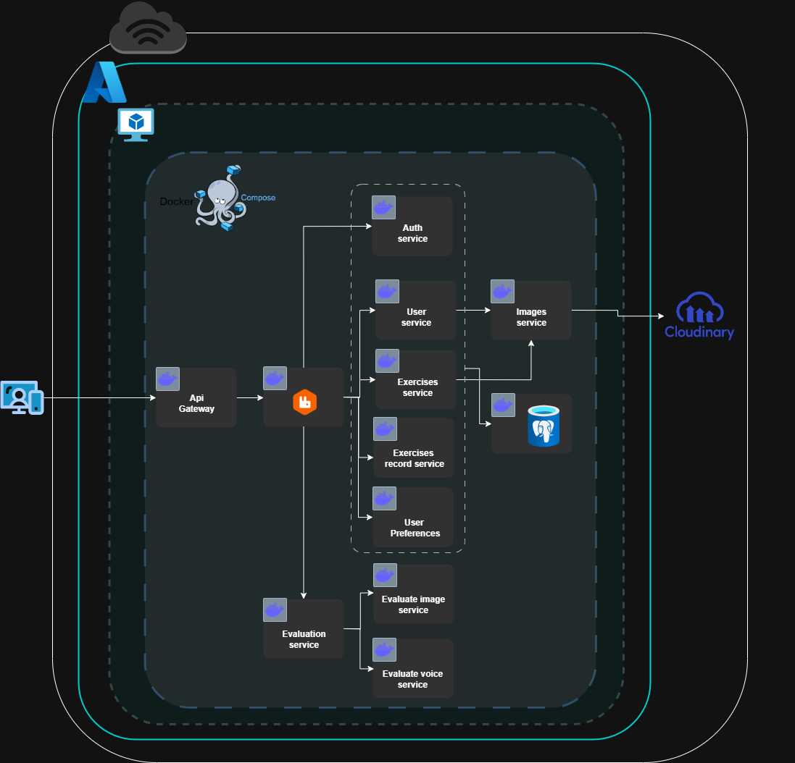

# 📚 Sistema de Alfabetización Interactiva

Este sistema está diseñado para apoyar el proceso de alfabetización de estudiantes que aún no saben leer ni escribir. A través de una aplicación móvil intuitiva, el estudiante interactúa directamente con el sistema, mientras que el alfabetizador guía el proceso educativo.

---

## 🎯 Objetivo

Optimizar el proceso de enseñanza-aprendizaje en alfabetización, mediante la personalización de ejercicios que refuercen las habilidades del estudiante, garantizando un avance progresivo y adaptativo.

---

## 👨‍🏫 ¿Cómo Funciona?

### 1. Evaluación Inicial

El maestro alfabetizador ayuda al registro del alumno.

### 2. Generación de Recomendaciones

A partir de los resultados, el sistema utiliza algoritmos genéticos para seleccionar ejercicios adecuados al nivel del alumno.

### 3. Retroalimentación Continua

Con cada ejercicio realizado, el sistema reevalúa el desempeño y reajusta automáticamente las futuras recomendaciones.

### 4. Ciclo Adaptativo

Este proceso se repite de forma continua, permitiendo un aprendizaje guiado y eficiente.

---

## 📌 Requerimientos

- [Figma](https://www.figma.com/design/4fOGKxdRmPlVNWOZCw0Q35/ICHEJA-Estudiantes?node-id=0-1&p=f&t=pkAJG5SWCLrRrfDT-0)  

---

## 🖥️ Interacción de usuario y diseño

- **Arquitectura cloud**  

- **Arquitectura de la información**

---
