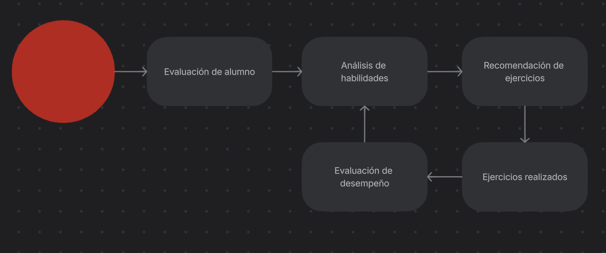
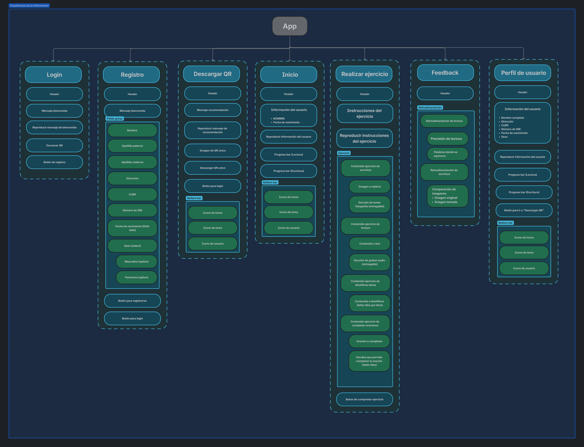

# 📚 Sistema de Alfabetización Interactiva

Este sistema está diseñado para apoyar el proceso de alfabetización de estudiantes que aún no saben leer ni escribir. A través de una aplicación móvil intuitiva, el estudiante interactúa directamente con el sistema, mientras que el alfabetizador guía el proceso educativo.

---

## 🎯 Objetivo

Optimizar el proceso de enseñanza-aprendizaje en alfabetización, mediante la personalización de ejercicios que refuercen las habilidades del estudiante, garantizando un avance progresivo y adaptativo.

---

## 👨‍🏫 ¿Cómo Funciona?

### 1. Evaluación Inicial

El maestro alfabetizador ayuda al registro del alumno.

### 2. Generación de Recomendaciones

A partir de los resultados, el sistema utiliza algoritmos genéticos para seleccionar ejercicios adecuados al nivel del alumno.

### 3. Retroalimentación Continua

Con cada ejercicio realizado, el sistema reevalúa el desempeño y reajusta automáticamente las futuras recomendaciones.

### 4. Ciclo Adaptativo

Este proceso se repite de forma continua, permitiendo un aprendizaje guiado y eficiente.

---

## 📌 Requerimientos

- [Figma](https://www.figma.com/design/4fOGKxdRmPlVNWOZCw0Q35/ICHEJA-Estudiantes?node-id=0-1&p=f&t=pkAJG5SWCLrRrfDT-0)  

---

## 🖥️ Interacción de usuario y diseño

- **Arquitectura cloud**  

- **Arquitectura de la información**

---

## 🧑‍💻 Base de datos

### Tablas

En este apartado se listan las tablas que conforman el esquema de la base de datos, detallando cada una a partir de un diccionario de datos, para comprender el propósito y atributos de cada tabla.

#### **Relacionando a personas**

Contiene las opciones registradas para denotar el tipo de vialidad de una dirección domiciliaria.

##### **Tabla: Tipo_Vialidad**

Contiene las opciones registradas para denotar el tipo de vialidad de una dirección domiciliaria.

| Campo            | Tipo        | Restricciones              | Descripción                              |
|------------------|------------|----------------------------|------------------------------------------|
| ID_Tipo_Vialidad | Int        | PRIMARY KEY, INCREMENTAL   | Identificador único del tipo de vialidad |
| Nombre           | Varchar(64)|                            | Nombre del tipo de vialidad              |

##### **Tabla: Tipo_Asentamiento**

Contiene las opciones registradas para denotar el tipo de asentamiento de una dirección domiciliaria

| Campo                | Tipo        | Restricciones              | Descripción                                 |
|----------------------|------------|----------------------------|---------------------------------------------|
| ID_Tipo_Asentamiento | Int        | PRIMARY KEY, INCREMENTAL   | Identificador único del tipo de asentamiento|
| Nombre               | Varchar(64)|                            | Nombre del tipo de asentamiento             |

##### **Tabla: Persona**

Contiene toda la información relevante de identificación de las personas involucradas en el sistema.

| Campo             | Tipo         | Restricciones                                 | Descripción                                         |
|-------------------|--------------|-----------------------------------------------|-----------------------------------------------------|
| ID_Persona        | Int          | PRIMARY KEY, INCREMENTAL                      | Identificador único de la persona                   |
| Nombre_Completo   | Varchar(32)  |                                               | Nombre completo de la persona                       |
| Apellido_Paterno  | Varchar(32)  |                                               | Apellido paterno de la persona                      |
| Apellido_Materno  | Varchar(32)  |                                               | Apellido materno de la persona                      |
| CURP              | Varchar(18)  |                                               | Dígitos que conforman el CURP de la persona         |
| Número_INE        | Varchar(13)  |                                               | Dígitos que conforman el número de INE de la persona|
| Fecha_Nacimiento  | Date         |                                               | Fecha de nacimiento de la persona                   |
| Genero            | Enum("M","F")|                                               | Género de la persona                                |
| Codigo_Postal     | Varchar(5)   |                                               | Código de oficina de la localidad de la persona     |
| Estado            | Varchar(100) |                                               | Estado de residencia de la persona                  |
| Municipio         | Varchar(100) |                                               | Municipio de residencia de la persona               |
| Localidad         | Varchar(100) |                                               | Localidad de residencia de la persona               |
| Vialidad_Nombre   | Varchar(100) |                                               | Nombre de la vialidad de residencia de la persona   |
| Vialidad_Tipo     | Int          | FOREIGN KEY (Tipo_Vialidad.ID_Tipo_Vialidad)  | Tipo de vialidad de asentamiento de residencia      |
| Asentamiento      | Varchar(100) |                                               | Nombre del asentamiento de residencia de la persona |
| Asentamiento_Tipo | Int          | FOREIGN KEY (Tipo_Asentamiento.ID_Tipo_Asentamiento) | Tipo de asentamiento de residencia de la persona    |

##### **Tabla: Institucion**

El catálogo de las instituciones registradas en el sistema.

| Campo         | Tipo        | Restricciones            | Descripción                          |
|---------------|------------|--------------------------|--------------------------------------|
| ID_Institucion| Int        | PRIMARY KEY, INCREMENTAL | Identificador único de la institución|
| Nombre_completo| Varchar(64)|                          | Nombre de la institución             |

##### **Tabla: Rol**

Lista de los roles contemplados para el sistema.

| Campo   | Tipo        | Restricciones            | Descripción                    |
|---------|------------|--------------------------|--------------------------------|
| ID_Rol  | Int        | PRIMARY KEY, INCREMENTAL | Identificador único del rol    |
| Nombre  | Varchar(64)|                          | Nombre del rol                 |

##### **Tabla: Horarios_disponibles**

Lista de los horarios disponibles registrados para las personas involucradas.  

| Campo                 | Tipo                   | Restricciones            | Descripción                        |
|-----------------------|------------------------|--------------------------|------------------------------------|
| ID_Horarios_Disponibles | Int                  | PRIMARY KEY, INCREMENTAL | Identificador único del horario    |
| Dia                   | Enum (Días de la semana)|                          | Día de la semana                   |
| Hora                  | Time                   |                          | Hora                               |

##### **Tabla: Persona_Rol_Horarios**

Contiene el registro de los horarios disponibles de las personas, delimitando el horario a un rol correspondiente.

| Campo                   | Tipo | Restricciones | Descripción                   |
|-------------------------|------|---------------|-------------------------------|
| ID_Persona              | Int  | UNIQUE        | Identificador de la persona   |
| ID_Horarios_Disponibles | Int  | UNIQUE        | Identificador del horario     |
| ID_Rol                  | Int  |               | Identificador del rol         |

##### **Tabla: Celula**

Contiene la información correspondiente a las células (grupos) formadas por las instituciones.

| Campo         | Tipo        | Restricciones                              | Descripción                                         |
|--------------|------------|--------------------------------------------|-----------------------------------------------------|
| ID_Celula    | Int        | PRIMARY KEY, INCREMENTAL                   | Identificador único de la célula                    |
| ID_Institucion| Int       | FOREIGN KEY (Institucion.ID_Institucion)   | Identificador de la institución autora              |
| ID_Persona   | Int        | FOREIGN KEY (Persona.ID_Persona)           | Identificador de la persona responsable (PVBS)      |
| Fecha_Inicio | Date       |                                            | Fecha de inicio de la célula                        |
| Fecha_Final  | Date       |                                            | Fecha de finalización de la célula                  |

##### **Tabla: Celula_Educador**

Contiene el registro de la pertenencia de los educadores a sus respectivas células.

| Campo      | Tipo | Restricciones                      | Descripción                                 |
|------------|------|------------------------------------|---------------------------------------------|
| ID_Persona | Int  | PRIMARY KEY, INCREMENTAL           | Identificador único del educador            |
| ID_Celula  | Int  | FOREIGN KEY (Celula.ID_Celula)     | Identificador de la célula                  |

##### **Tabla: Educando**

Registro de la información de las personas que formarán parte de los educandos del programa de alfabetización.

| Campo      | Tipo         | Restricciones     | Descripción                                 |
|------------|--------------|------------------|---------------------------------------------|
| ID_Educando| Int          | INCREMENTAL      | Identificador único del educando            |
| ID_Persona | Int          | PRIMARY KEY      | Identificador de la persona                 |
| ID_Educador| Int          | DEFAULT NULL     | Identificador del educador asignado         |
| QR_Ruta    | Varchar(100) |                  | Ruta que redirecciona al QR generado        |

#### **Relacionando a Ejercicios**

##### **Tabla: Unidad**

Contiene el catálogo registrado de las unidades, es decir, las agrupaciones de los temas. 

| Campo   | Tipo        | Restricciones            | Descripción                |
|---------|------------|--------------------------|----------------------------|
| ID_Unidad | Int      | PRIMARY KEY, INCREMENTAL | Identificador único de la unidad |
| Nombre   | Int       |                          | Nombre de la unidad        |

##### **Tabla: Habilidad**

Contiene el listado de todas las habilidades que se abordarán en el sistema de alfabetización.

| Campo      | Tipo        | Restricciones            | Descripción                      |
|------------|------------|--------------------------|----------------------------------|
| ID_Habilidad | Int      | PRIMARY KEY, INCREMENTAL | Identificador único de la habilidad |
| Nombre      | Int       |                          | Nombre de la habilidad           |

##### **Tabla: Tema**

Contiene el listado de todos los temas que se abordarán en el sistema de alfabetización.

| Campo     | Tipo        | Restricciones            | Descripción                    |
|-----------|------------|--------------------------|--------------------------------|
| ID_Tema   | Int        | PRIMARY KEY, INCREMENTAL | Identificador único del tema   |
| Nombre    | Int        |                          | Nombre del tema                |

##### **Tabla: Secuencia_Temas**

Registro de la secuencia que deben seguir los temas, trazando la ruta entre los temas.

| Campo            | Tipo | Restricciones                          | Descripción                          |
|------------------|------|----------------------------------------|--------------------------------------|
| ID_Tema          | Int  | FOREIGN KEY (Tema.ID_Tema), UNIQUE     | Identificador único del tema actual  |
| ID_Tema_Siguiente| Int  | FOREIGN KEY (Tema.ID_Tema), UNIQUE     | Identificador único del tema siguiente|

##### **Tabla: Reactivo **

Contiene toda la información de las plantillas de las cuales surgieran los ejercicios, entendámoslo como la base para la generación de diversos ejercicios.

| Campo          | Tipo        | Restricciones                    | Descripción                                 |
|----------------|------------|----------------------------------|---------------------------------------------|
| ID_Reactivo    | Int        | PRIMARY KEY, INCREMENTAL         | Identificador único del reactivo            |
| Titulo         | Varchar(64)|                                  | Titulo del reactivo                         |
| Subtitulo      | Varchar(64)|                                  | Subtitulo del reactivo                      |
| Contenido      | Text       |                                  | Descripción del reactivo                    |
| Tiempo_Sugerido| Time       |                                  | Tiempo sugerido para los ejercicios generados|
| ID_Tema        | Int        | FOREIGN KEY (Tema.ID_Tema)       | Pertenencia a un tema                       |

##### **Tabla: Reactivo_Habilidades**

Mapeado de las habilidades que aborda un reactivo, es decir, que habilidades se utilizarán en la resolución de los ejercicios derivados de la plantilla.

| Campo        | Tipo   | Restricciones | Descripción                                      |
|--------------|--------|---------------|--------------------------------------------------|
| ID_Reactivo  | Int    |               | Identificador único del reactivo                  |
| ID_Habilidad | Int    |               | Identificador único de la habilidad               |
| Cobertura    | Float  |               | Medida en la que se aborda la habilidad del 0 a 1 |

##### **Tabla: Tipo_Ejercicio**

Contiene el listado de tipos de los ejercicios definidos para el sistema de alfabetización.

| Campo            | Tipo        | Restricciones            | Descripción                        |
|------------------|------------|--------------------------|------------------------------------|
| ID_Tipo_Ejercicio| Int        | PRIMARY KEY, INCREMENTAL | Identificador único del tipo de ejercicio |
| Nombre           | Varchar(64)|                          | Nombre del tipo de ejercicio       |

##### **Tabla: Ejercicio_Tipos**

Contiene el mapeo de los tipos de cada ejercicio.

| Campo            | Tipo | Restricciones | Descripción                              |
|------------------|------|---------------|------------------------------------------|
| ID_Tipo_Ejercicio| Int  |               | Identificador único del tipo de ejercicio|
| ID_Ejericicio    | Int  |               | Identificador único del ejercicio        |

##### **Tabla: Ejercicio**

Contiene las instancias de los reactivos, es decir, los ejercicios derivados de las plantillas denominadas reactivos.

| Campo          | Tipo           | Restricciones | Descripción                                   |
|----------------|----------------|--------------|-----------------------------------------------|
| ID_Ejercicio   | Int            |              | Identificador único del ejercicio             |
| ID_Reactivo    | Int            |              | Identificador único del reactivo              |
| Instrucciones  | Text           |              | Pasos para la resolución del ejercicio        |
| Rutas_Imagenes | Array<Varchar> |              | Listado de las imágenes necesarias            |
| Contexto       | Object         |              | Detalles extras correspondientes al ejercicio |

#### **Relacionando a Educandos y Ejercicios**

##### **Tabla: Educando_Ejercicios**

Contiene el listado de los ejercicios realizados por los educandos, llevando un registro de los detalles de la entrega.

| Campo                | Tipo      | Restricciones            | Descripción                                         |
|----------------------|-----------|--------------------------|-----------------------------------------------------|
| ID_Educando_Ejercicio| Int       | PRIMARY KEY, INCREMENTAL | Identificador único de la entrega realizada         |
| ID_Educando          | Int       |                          | Identificador único del educando                    |
| ID_Ejercicio         | Int       |                          | Identificador único del ejercicio                   |
| Fecha_Asignacion     | Datetime  |                          | Fecha en la que se le asignó al educando            |
| Fecha_Completado     | Datetime  |                          | Fecha de entrega del educando                       |

##### **Tabla: Educando_Ejercicio_Habilidades**

Contiene el mapeo del puntaje obtenido por el educando en las habilidades abordadas por el ejercicio.

| Campo                  | Tipo | Restricciones                                   | Descripción                                         |
|------------------------|------|-------------------------------------------------|-----------------------------------------------------|
| ID_Educando_Ejercicio  | Int  | FOREIGN KEY (Educando_Ejercicios.ID_Educando_Ejercicio) | Identificador único de la entrega realizada por el educando |
| ID_Habilidad           | Int  |                                                 | Identificador único de la habilidad                 |
| Puntaje                | Int  |                                                 | Puntaje obtenido por el educando en la habilidad    |

### Relaciones

En este apartado se describen las relaciones primordiales definidas entre las entidades definidas en el anterior apartado “Tablas”. En cada relación se hace mención de las entidades consideradas y en que tabla observamos la relación. 

#### **Entidad: Persona**

1. Una persona tiene un tipo de vialidad para su dirección domiciliaria. **Tabla: Persona**.

2. Una persona tiene un tipo de asentamiento para su dirección domiciliaria. **Tabla: Persona**.

3. Una persona puede tener múltiples horarios disponibles, cada horario definido para un rol ejercido por la persona. **Tabla: Personal_Rol_Horarios**.

4. Una persona puede ejercer el rol de educador asignado a un educando. **Tabla: Personal_Rol_Horarios**, **Educando**.

5. Una persona puede ejercer el rol de educando. **Tabla: Educando**.

#### **Entidad: Celula**

1. Una célula pertenece a una institución. **Tabla: Celula**.

2. Una persona puede ejercer el rol de encargado de una célula, es decir, como PVBS. **Tabla: Celula**.

3. Una persona que ejerce el rol de educador puede pertenecer a una célula en especifico. **Tabla: Celula_Educador**.

#### **Entidad: Tema**

1. Un tema pertenece a una unidad. **Tabla: Tema**.

2. Un tema da paso a uno o más temas. **Tabla: Secuencia_Temas**.

#### **Entidad: Reactivo**

1. Un reactivo pertenece a un tema. **Tabla: Reactivo**.

2. Un reactivo aborda uno o más habilidades. **Tabla: Reactivo_Habilidades**.

#### **Entidad: Ejercicio**

1. Un ejercicio es derivado de un reactivo. **Tabla: Ejercicio**.

2. Un ejercicio puede tener uno o muchos tipos de ejercicios. **Tabla: Ejercicio_Tipos**.

#### **Entidad: Educando**
1. Un educando puede realizar ejercicios. **Tabla: Educando_Ejercicios**.

2. Un educando puede ser evaluado a uno o muchas habilidades por ejercicios. **Tabla: Educando_Ejercicio_Habilidades**.

### Restricciones

En este apartado se abordarán las restricciones lógicas conforme al dominio definido para el sistema de alfabetización.

#### **PVBS**

1. Una persona no puede ser encargada de una célula, si esta no tiene al menos un horario disponible registrado con el rol de PVBS.

#### **Educador**

1. Una persona no puede ser asignada como educador a un alumno, si este no tiene al menos un horario disponible registrado con el rol de Educador.

2. Una persona no puede ser registrada como educador de una célula, si no tiene al menos un horario disponible registrado con el rol de Educador.

#### **Temas**

1. Referente a la secuencialidad de los temas, se debe respetar la ruta trazada por la planeación de los temas, sin romper dependencias entre los mismos.
